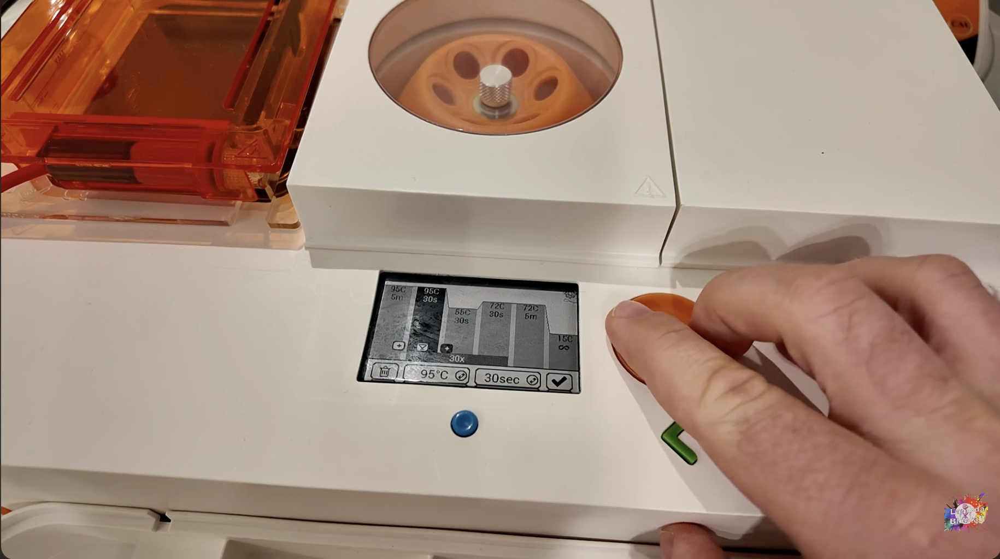

# bentolab

[](https://www.codefactor.io/repository/github/lambda-biolab/bentolab)
[](https://github.com/Lambda-Biolab/bentolab/actions/workflows/codeql.yml)
[](https://github.com/Lambda-Biolab/bentolab/network/updates)

Python control library for [Bento Lab](https://bento.bio/) PCR workstations
(Bento Bioworks, London). Communicates over Bluetooth LE using the Nordic UART
Service protocol, reverse-engineered from the official Bento Bio app.



*My Bento Lab Pro V1.4 (unit BL13489) mid-run — the device this library was reverse-engineered against.*

## Target Devices

| Unit | Hardware | Serial | Connectivity | Status |
|------|----------|--------|-------------|--------|
| 1 | Pro V1.4 | BL13489 | Bluetooth LE | Primary, fully supported |
| 2 | Pro V1.31 | BL13125 | Wi-Fi | Protocol TBD |

## Setup

```bash
# One-command setup (requires uv)
make setup

# Or manually:
uv venv --python 3.13
uv pip install -r requirements.txt
```

## Library Usage

```python
from bentolab import BentoLabBLE, PCRProfile

async def main():
    lab = BentoLabBLE()
    await lab.connect()

    profile = PCRProfile(
        name="Standard PCR",
        initial_denaturation=(95, 180),
        cycles=35,
        denaturation=(95, 30),
        annealing=(58, 30),
        extension=(72, 60),
        final_extension=(72, 300),
    )

    await lab.start_pcr(profile)
    state = await lab.get_state()
    print(f"Cycle {state.current_cycle}/{state.total_cycles} @ {state.block_temperature}C")
```

## Command-line interface

`bentolab` ships a Typer CLI that subsumes the one-off scripts in `tools/`.
Profiles live as YAML in the platform user-data directory; runs are recorded
as NDJSON in the same tree (or override with `BENTOLAB_DATA_DIR`).

```bash
bentolab scan                           # discover devices
bentolab status                         # one snapshot
bentolab monitor                        # live tail of status broadcasts
bentolab profile new my-profile         # opens $EDITOR on a YAML template
bentolab profile list
bentolab profile import path/to/x.yaml
bentolab run my-profile                 # uploads + starts + tails until done
bentolab stop                           # abort the current run
bentolab logs list
bentolab logs show <run-id>
```

Profile YAML:

```yaml
name: HF-Pgl3-EGFP-Puro-linear
lid_temperature: 110
initial_denaturation: { temperature: 95, duration: 300 }
cycles:
  - repeat: 35
    denaturation: { temperature: 98, duration: 10 }
    annealing:    { temperature: 60, duration: 30 }
    extension:    { temperature: 72, duration: 150 }
final_extension:  { temperature: 72, duration: 300 }
hold_temperature: 4
notes: ""
```

Every subcommand accepts `--json` for machine-readable output. Exit codes:
`0` ok, `2` user error, `3` device error, `4` aborted.

## Tools (low-level / RE debug)

| Tool | Purpose |
|------|---------|
| `tools/ble_scanner.py` | Discover BLE devices, enumerate GATT profiles |
| `tools/ble_monitor.py` | Subscribe to all BLE notifications passively |
| `tools/ble_commander.py` | Interactive BLE command REPL with fuzzing |
| `tools/wifi_scanner.py` | mDNS/nmap discovery for Wi-Fi unit |
| `tools/wifi_monitor.py` | Passive TCP traffic capture |
| `tools/session_logger.py` | Compatibility shim — re-exports `bentolab._logging.SessionLogger` |

For day-to-day operation use the `bentolab` CLI above; the scripts in
`tools/` are kept for protocol-decoding work.

## Quick Start

```bash
# Scan for BLE devices
python tools/ble_scanner.py --scan-time 10

# Connect and enumerate GATT profile
python tools/ble_scanner.py --connect --device-name "Bento"

# Interactive exploration
python tools/ble_commander.py
```

## Documentation

- [BLE GATT Profile](docs/ble-gatt-profile.md)
- [Protocol Commands](docs/protocol-commands.md)
- [Firmware Analysis](docs/firmware-analysis.md)
- [Wi-Fi Protocol](docs/wifi-protocol.md)

## License

[MIT](LICENSE).

## Disclaimer

Not affiliated with, endorsed by, or sponsored by Bento Bioworks Ltd.
"Bento Lab" is a trademark of Bento Bioworks. Protocol information in this
repository was determined through interoperability analysis of BLE
communication with devices owned by the author, consistent with DMCA §1201(f)
(US) and Article 6 of the EU Software Directive 2009/24/EC.
